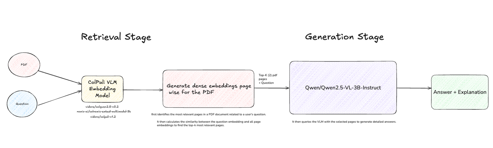
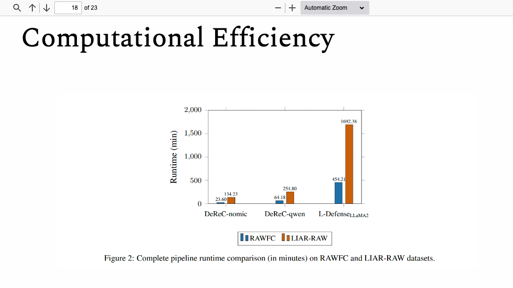
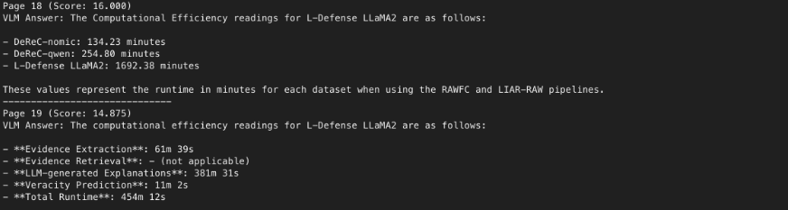
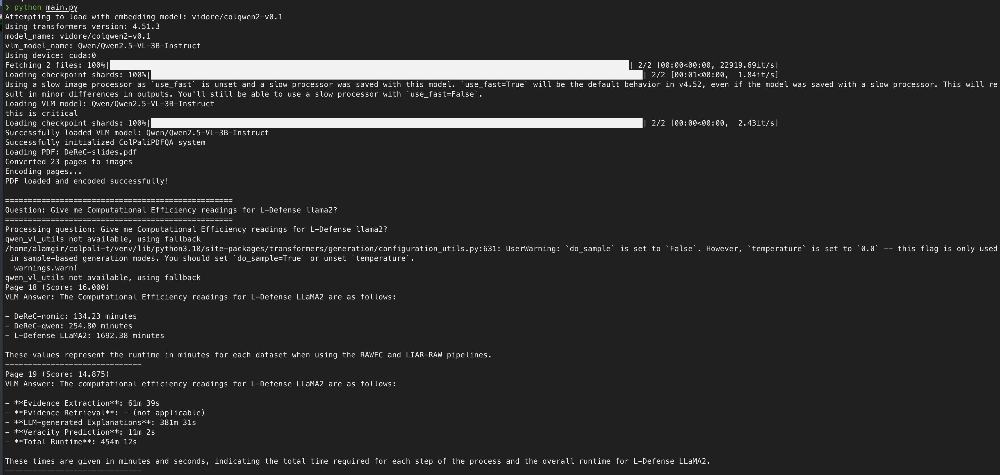

# 2-Stage Retrieval Pipeline using ColPali and Vision Language Model (VLM)

## Experiment

To test this, I provided a 23-page PDF and asked:  
**"Give me Computational Efficiency readings for L-Defense Llama2?"**

The answer was embedded in visual charts on specific pages. For ColPali to answer effectively, it had to:

✅ Process the query  
✅ Understand the entire 23-page PDF visually  
✅ Locate relevant charts/tables and extract precise numerical data  
✅ Identify the exact pages containing the answer  

## Pipeline Overview

The pipeline used a two-stage approach combining **ColQwen2** (`vidore/colqwen2-v0.1`) and **Qwen2.5-VL-3B-Instruct**:

1. **ColQwen2**: Converts PDF pages to embeddings and identifies the most relevant pages via similarity search.  
2. **Qwen2.5-VL**: Analyzes the top-ranked page images to answer the query.  



## Results 

The results were highly accurate, successfully identifying page 18 with the correct answer and extracting precise numbers:  



- **Total Runtime**: 454m 12s  



It also provided exact page references for verification. 🎯



## Why ColPali?

Unlike traditional OCR → text extraction → LLM pipelines, ColPali treats document pages as images and creates rich multimodal embeddings that capture both textual content and visual layout. This enables it to understand complex tables, charts, and spatial relationships between elements.

ColPali's foundation integrates:  
- A text encoder (ColBERT's multi-vector retrieval model)  
- A vision-language model (recent versions use Qwen2.5-VL, which outperforms PaliGemma)  

Learn more about ColPali [ICLR 2025]: [arXiv:2407.01449](https://arxiv.org/abs/2407.01449)

## Installation

```bash
# Create virtual environment with Python 3.10
uv venv venv --python 3.10

# Activate virtual environment
source venv/bin/activate

# Install dependencies
uv pip install colpali-engine pymupdf pillow torch transformers matplotlib opencv-python numpy qwen_vl_utils git+https://github.com/illuin-tech/colpali